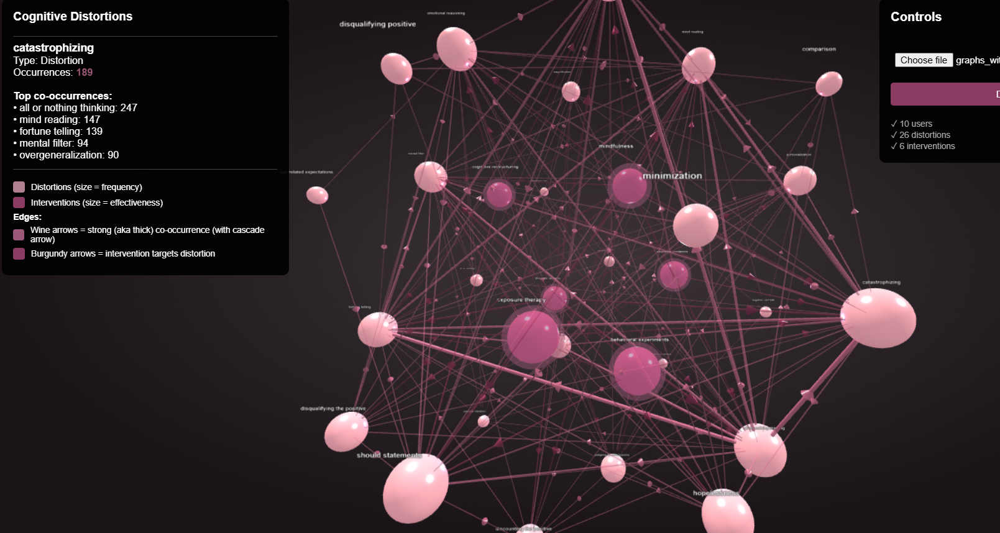
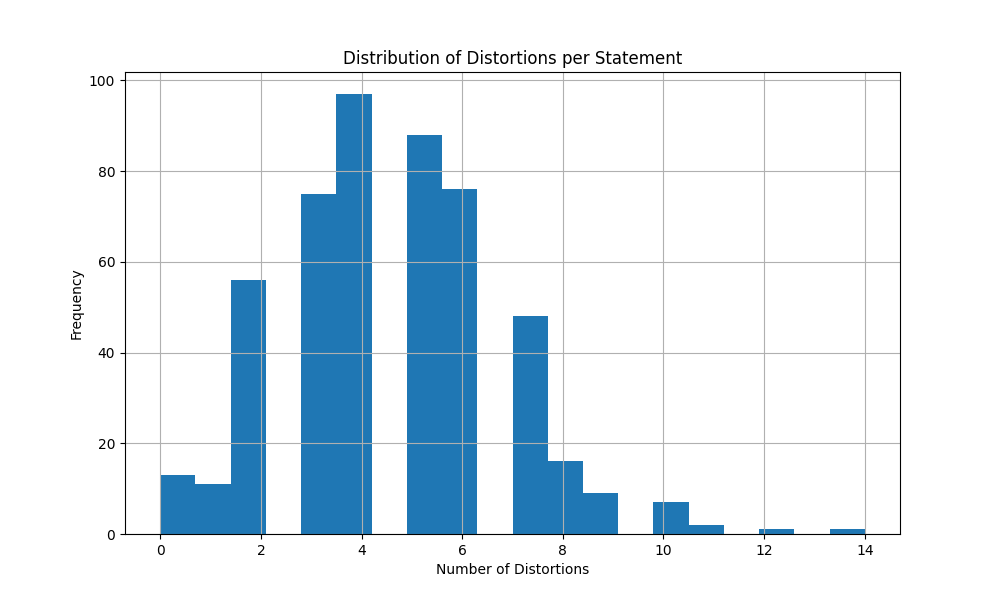

# GeAR: Graph-Enhanced Agent for Retrieval: Synthetic Cognitive Distortion Network

GeAR applies graph-enhanced retrieval to mental health, mapping cognitive distortions (commonly present in depression, anxiety and other mental health disorders) as interconnected networks to provide personalized intervention recommendations. GeAR matches structural patterns: users with similar distortion network topologies get interventions that worked for others with the same graph structure.

## What the Code Does
- Extracts cognitive distortions from text using LLMs (Claude API) from a ([Kaggle Dataset](https://www.kaggle.com/datasets/suchintikasarkar/sentiment-analysis-for-mental-health?resource=download))
- Maps distortion patterns as knowledge graphs: cascades, co-occurrences, centrality
- Generates synthetic longitudinal user journeys with intervention tracking: 2 entries per week with different journey types, such as improving, fluctuating or worsening for 12 weeks
- Retrieves interventions based on graph topology similarity, not just semantic matching
- Visualizes networks in interactive 3D (distortions + interventions + effectiveness)

1. **Data Pipeline**: Kaggle mental health dataset → distortion extraction → synthetic longitudinal generation
2. **Graph Layer**: Personal graphs (per-user networks) + Global graph (population patterns) + Intervention graph (what targets what)
3. **Retrieval**: Multi-metric graph similarity (node overlap, edge overlap, centrality matching)
4. **Visualization**: 3D force-directed graph with intervention effectiveness highlighting

Tech Stack:
- Python (NetworkX, pandas, anthropic)
- Claude Sonnet 4 for distortion extraction
- Three.js for 3D visualization
- Graph algorithms: centrality analysis, cascade detection, subgraph matching

What has been done:
- 500 labeled statements with distortions from a Kaggle dataset
- 10 synthetic users with longitudinal data
- Intervention-enhanced graphs
- 3D visualization with effectiveness scoring
- ToDo: RAG interface 

For example:

Input: "I'll definitely fail this presentation, everyone will judge me"  
Output: Pattern matched to users with catastrophizing→mind_reading cascade. Recommended: Behavioral experiments (82% effectiveness, 0.5 avg improvement).

## Potential Sources of Error
Clearly, I didn't process and extract cognitive distortions from each statement in the Kaggle dataset (with Claude as an LLM that would amount to approximately $500), so I took only a random sample of lengthy quotes (n = 500). The longitudinal data was generated synthetically, because getting longitudinal data from clients with mental health concerns is a) practically difficult and a lengthy process, and b) raises ethical concerns. The data was generated from one random prompt statement from one of the selected 500 rows of the Kaggle dataset with now extracted cognitive distortions. Arguably, a smarter strategy were to inject each diary entry of each synthetic user with a random statement from the selected rows of the preprocessed Kaggle dataset, but the idea was to suggest and rate the effectiveness of different interventions for specific cognitive distortions - hence, why each user journey was inspired by only one statement from the initial Kaggle dataset. Then, the synthetic data consisists of 2 entries a week for 12 weeks with different journey trajectories for a small pool of synthetic people (n = 10). The journey trajectory types were randomly assigned and, for example, there was only one "worsening" journey trajectory in the end results. The pool of people is very small. The interventions for each synthetic user journey type were suggested manually - again, real datasets on real patients' data are quite rare. Overall, I thought this was a cool concept and, if based on real life data, could help in treatment, but also in daily personal wellness/mindfulness activities outside therapy sessions to visualize thinking patterns and common traps from journaling entries. 

